# 👋 Hi, I'm Lithiga Jayaprakash!

<div align="center">
  
</div>

<p align="center">
  
</p>

<!-- Animated Gradient Line -->


## 🧬 **Research DNA**

```python
class LithigaResearch:
    def __init__(self):
        self.name = "Lithiga Jayaprakash"
        self.education = "B.E + M.E AI/ML @ Chandigarh University (2022-27)"
        self.research_areas = ["Computer Vision", "Reinforcement Learning", "Affective Computing"]
        self.publications = 3
        self.motto = "Turning curiosity into innovation 🔬"
    
    def current_focus(self):
        return {
            "research": "Multimodal Learning Systems",
            "learning": "What sparks my curiosity ✨",
            "goal": "Publish at top conferences"
        }
    
me = LithigaResearch()
```

<!-- Dynamic Quote -->
<div align="center">
  
</div>


## 🔬 **Research Publications**

<div align="center">
  
| Status | Title | Field | Year |
|:-------|:------|:------|:-----|
| 📄 **Under Publication** | Emotion-Aware Adaptation in E-Learning: A Real-Time Multimodal Virtual Teaching Assistant | AI in Education | 2024 |
| ✅ **Published** | Real-Time Umpire Signal Detection in Cricket: A Hybrid Deep Learning Solution | Computer Vision | 2024 |
| ✅ **Published** | Autonomous Driving System Based on Deep Q Learning | Reinforcement Learning | 2024 |

</div>

## 🧪 **Research Projects Showcase**

<div align="center">
  
| Project | Tech Stack | Status |
|:--------|:-----------|:-------|
| 🎓 **Emotion-Aware Teaching Assistant** | `CNN` `LSTM` `Computer Vision` | 📄 Under Publication |
| 🏏 **Cricket Umpire Signal Detection** | `Hybrid DL` `Video Processing` | ✅ Published |
| 🚗 **Autonomous Driving with DQN** | `Deep Q Learning` `Reinforcement Learning` | ✅ Published |
| 🔐 **Ransomware Detection** | `Ensemble Learning` `Scikit-learn` | 💻 Completed |
| 🤟 **Indian Sign Language Detector** | `OpenCV` `Gesture Recognition` | 💻 Completed |

</div>


## 💻 **Research Stack**

<div align="center">

### **Core Technologies**


### **Deep Learning Frameworks**


### **Research Tools**


### **Data Science Stack**


</div>


## 📊 **Research Analytics**

<div align="center">
  
| Metric | Value |
|:-------|:------|
| 📝 **Publications** | 3 (2 Published, 1 Under Review) |
| 💻 **Research Projects** | 5 Active Projects |
| 🤝 **Collaborations** | Open for Research |

</div>

<div align="center">
  

  

  <br><br>

  
</div>
<br>

<div align="center">
  
| 📊 **Contributions** | 🔥 **Current Streak** | ⚡ **Longest Streak** |
|:--------------------:|:---------------------:|:---------------------:|
| 23 | 0 | 3 |

</div>

<!-- GitHub Activity Graph with Custom Colors -->


## 🌐 **Research Presence**

<div align="center">

[](https://www.linkedin.com/in/lithiga-jayaprakash-51881525a/)
[](https://www.researchgate.net/profile/Lithiga-Jayaprakash)
[](mailto:lithigaj28@gmail.com)
[](https://github.com/Lithigaj)

</div>

## 🎯 **Current Research Focus**

<div align="center">

### **Publications** ⋆ **Affective Computing** ⋆ **Multimodal AI**
### **Deep Q Learning** ⋆ **Autonomous Systems** ⋆ **Policy Optimization**
### **Adaptive Learning** ⋆ **Emotion Recognition** ⋆ **Conference Talks**
### **Journal Papers** ⋆ **Research Collaborations**

```mermaid
mindmap
  root((🧠 Research))
    📊 Computer Vision
      🏏 Sports Analytics
      🤟 Gesture Recognition
      👁️ Object Detection
    🤖 Reinforcement Learning
      🚗 Autonomous Systems
      🎮 Deep Q Learning
      📈 Policy Optimization
    💜 Affective Computing
      🎓 Emotion Recognition
      📚 Adaptive Learning
      👥 Multimodal AI
    📝 Publications
      📑 Journal Papers
      🎤 Conference Talks
      🤝 Research Collabs
```




</div>


## 🏆 **Achievements**

<div align="center">

| Achievement |
|:------------|
| 📄 Paper Accepted: Emotion-Aware E-Learning System |
| ✅ Published: Umpire Signal Detection in Cricket |
| ✅ Published: Autonomous Driving with Deep Q Learning |
| 🔬 Active Research in Multimodal Learning |
| 🤝 Open for Research Collaborations |

</div>


## 📬 **Let's Collaborate!**

<div align="center">
  
### 💡 *"The important thing is not to stop questioning. Curiosity has its own reason for existing." – Albert Einstein*

<br>

**📧 Research Inquiries:** [lithigaj28@gmail.com](mailto:lithigaj28@gmail.com)

<br>

[](https://www.researchgate.net/profile/Lithiga-Jayaprakash)
[](https://github.com/Lithigaj)

<br>


</div>

---

<div align="center">
  
### ⚡ *"Research is creating new knowledge." – Neil Armstrong* ⚡

**Open for research collaborations and academic discussions!**


</div>

---
